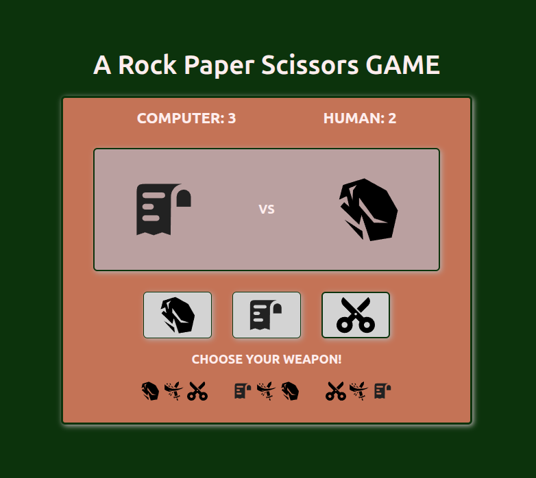

# odin-rps

A game of **Rock Paper Scissors**, part of the Odin Project curriculum, [Foundations Course](https://www.theodinproject.com/paths/foundations/courses/foundations). 

> *This is my third project - a browser console game with no initial GUI. The objective of this project is to practice the basic JavaScript concepts studied so far.*

> **Update:** *UI added as part of the [course](https://www.theodinproject.com/lessons/foundations-revisiting-rock-paper-scissors)*

---
## JavaScript skills demonstrated:
- performing string and number operations
- using logical and mathematicaal operators
- using the browser Developer Tools
- writing functions and returning values
- problem solving techniques
- understanding and resolving errors
- creating, removing DOM elements
- adding Event listeners
- writing clean explanatory code
- writing clear and concise comments

---
## GIT skills demonstrated
- staging and commiting to GIT
- creating a new GIT branch
- merging GIT branches
- deleting GIT branches